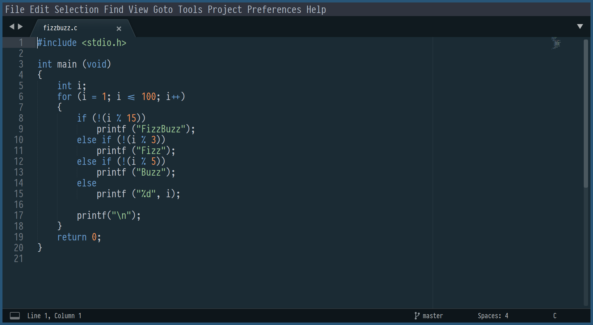

# Oceanic Primal Color Scheme for Sublime Text

**Not** [base16](http://chriskempson.com/projects/base16/) theme: fewer color, more ocean

A minimalistic theme based on [Oceanic Primal palette](https://github.com/oceanic-primal/palette), inspired by [Oceanic Next Color Scheme](https://github.com/voronianski/oceanic-next-color-scheme).

Font on screenshot is [PragmataPro](https://fsd.it/shop/fonts/pragmatapro/)

-   [Oceanic Primal for VIM](https://github.com/barlog-m/oceanic-primal-vim)
-   [Oceanic Primal for IntelliJ IDEA](https://github.com/barlog-m/oceanic-primal-idea)
-   [Oceanic Primal for other programs](https://github.com/barlog-m/oceanic-primal)
